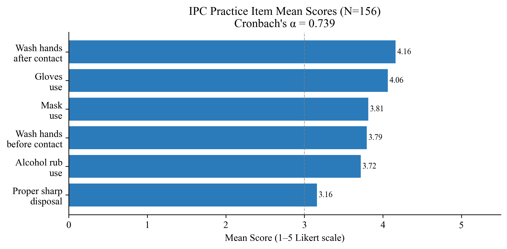
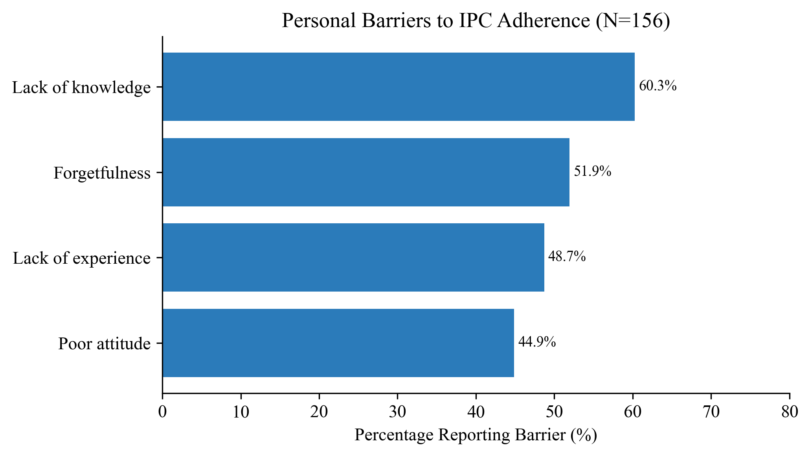
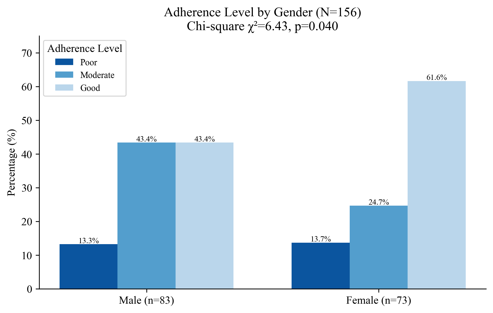

# Medical Students' Adherence to Infection Prevention Practices — Omdurman Islamic University

## Omdurman, Sudan – 2025

**Study type:** Cross-sectional descriptive study

**Degree level:** MBBS

**Institution:** Faculty of Medicine, Omdurman Islamic University

**Sample size:** N = 156 clinical-year medical students (4th and 5th year)

**Data analyst:** Abdulrahman Sirelkhatim

---

## Background

Healthcare-associated infections (HCAIs) represent one of the most significant patient
safety threats globally, affecting up to 10% of admitted patients in developing countries.
The prevention of HCAIs depends critically on consistent adherence to infection prevention
and control (IPC) measures — hand hygiene, appropriate use of personal protective equipment,
and safe sharps handling — among all healthcare workers, including trainees.

Medical students in clinical years occupy a unique position: they are routinely exposed to
patient care environments, engage in invasive procedures under supervision, and are in the
process of internalizing professional behaviors that will define their practice for decades.
Evidence from global and regional studies consistently shows a gap between students' IPC
knowledge and their actual practice, driven by personal factors such as forgetfulness and
attitude, and institutional factors such as supply shortages, overcrowding, and inadequate
supervision.

In Sudan, this challenge is compounded by the impact of the ongoing armed conflict, which
has disrupted health system infrastructure, reduced PPE availability, and affected
supervision quality at training hospitals. Despite the importance of the issue, no
published study had previously characterized IPC adherence levels, knowledge gaps, and
barriers among medical students at Omdurman Islamic University specifically. This study
provides that baseline assessment.

## Objectives

- Evaluate the level of knowledge about IPC practices, specifically the WHO 5 Moments of
Hand Hygiene, among clinical-year medical students
- Assess adherence to specific IPC practices including hand hygiene, PPE use, and sharps
disposal
- Identify personal and hospital-related barriers to IPC adherence
- Determine factors influencing adherence, including senior staff behavior and institutional
support
- Identify independent predictors of good IPC adherence

## Study Design & Methods

| Component | Detail |
|-----------|--------|
| Design | Cross-sectional descriptive |
| Setting | Faculty of Medicine, Omdurman Islamic University, with training centers in Atbara, Kassala, Kosti, Riyadh, and Cairo |
| Population | 4th and 5th year medical students in active clinical rotations (N=662) |
| Sampling | Stratified random sampling by academic year; 4th year n=72 (46.2%), 5th year n=84 (53.8%) |
| Sample size | Yamane formula, 7% margin of error → n=156 |
| Data collection | Self-administered Google Form questionnaire, distributed via official WhatsApp/Telegram groups (2025) |

**Instrument sections:**

| Section | Items | Type |
|---------|-------|------|
| Demographics | 3 | Categorical |
| IPC Training and Awareness | 4 binary + training type checklist | Binary |
| Knowledge: WHO 5 Moments | 5 checkbox items | Binary (correct/incorrect) |
| IPC Adherence Practices | 6 items | 5-point Likert (1=Never → 5=Always) |
| Barriers | 4 personal + 5 hospital | Checklist (binary) |
| Environmental Factors | 4 items | Categorical/Likert |
| Adherence Influences | 5 items | Checklist (binary) |

**Composite scores:**

| Score | Definition | Range |
|-------|------------|-------|
| Knowledge Score | Correct WHO 5 Moments identified | 0–5 |
| Total Adherence Score | Sum of 6 practice item Likert scores | 6–30 |
| Mean Adherence Score | Total ÷ 6 | 1–5 |
| Barriers (Personal) | Sum of 4 binary personal barriers | 0–4 |
| Barriers (Hospital) | Sum of 5 binary hospital barriers | 0–5 |

**Technical suite:**

| Tool | Purpose |
|------|---------|
| Python (pandas) | Data cleaning, multi-select expansion, score computation |
| IBM SPSS Statistics v26 | Full statistical analysis |
| Python (matplotlib, seaborn) | Figure generation |
| Jupyter Notebook | Exploratory data analysis |

**Statistical methods:**

- **Reliability:** Cronbach's Alpha (adherence scale); KR-20 equivalent (knowledge binary items)
- **Descriptive:** Frequencies, percentages, means, SDs
- **Bivariate:** Independent samples t-test (gender, training status, awareness variables,
year of study); one-way ANOVA with Tukey HSD (knowledge level, senior staff compliance);
chi-square (gender × levels, year × levels, knowledge × adherence)
- **Correlation:** Pearson r (continuous variables); Spearman ρ (senior staff compliance × adherence)
- **Multivariate:** Multiple linear regression (predictors of total adherence score),
hierarchical regression (incremental contribution of demographics, knowledge, and
environmental factors); binary logistic regression (predictors of good adherence)

## Dataset

| File | Description |
|------|-------------|
| `1_data/raw/raw_data.xlsx` | Raw Google Form export — 23 columns including multi-select checkbox responses |
| `1_data/cleaned/cleaned_data.xlsx` | Cleaned dataset: numeric-coded demographics, binary-expanded checklist variables, Likert-coded adherence items, composite scores, and categorical level variables |

> **Privacy note:** Raw data is excluded from version control. The cleaned file retains no
individual identifiers; participants are identified by sequential ID only.

## Repository Structure

```text
ipc-adherence-oiu-2025/
│
├── README.md
├── .gitignore
├── .ls-lint.yml
├── .markdownlint.yml
├── .markdownlintignore
│
├── 1_data/
│   ├── raw/                        ← excluded from version control (privacy)
│   └── cleaned/
│       └── cleaned_data.xlsx
│
├── 2_cleaning/
│   └── cleaning.py
│
├── 3_notebooks/
│   └── exploratory_analysis.ipynb
│
├── 4_analysis/
│   ├── full_analysis.sps
│   └── figures.py
│
├── 5_figures/
│   └── (14 figures)
│
└── 6_docs/
    └── results_chapter.docx
```

## Key Results

### Scale Reliability

- **IPC Adherence Scale (6 items):** Cronbach's α = **0.739** — acceptable internal consistency
- **Knowledge Scale (5 binary items):** Cronbach's α = **0.849** — good internal consistency

### Demographic Profile

The sample was slightly male-predominant (53.2% male), with fifth-year students comprising
53.8%. Mean age was 23.40 years (SD=1.23, range 20–27). Slightly more than half (51.3%)
had received previous IPC training. Awareness of infection risks was high (83.3%), while
knowledge of the 5 Moments (65.4%) and correct hand-washing technique (67.3%) showed
more room for improvement.

### IPC Knowledge

The mean knowledge score was **2.83 ± 1.45** out of 5. A notable bimodal distribution was
observed: 57.1% demonstrated good knowledge (4–5 correct), while 37.2% had poor knowledge
(0–2 correct), and only 5.8% scored at the moderate level.

| Moment | % Correct |
|--------|-----------|
| Before patient contact | 78.2% |
| After patient contact | 76.3% |
| After exposure to body fluids | 66.0% |
| After touching patient surroundings | 62.2% |
| Before cleaning/aseptic procedures | 57.1% |

### IPC Adherence

The mean total adherence score was **22.71 ± 4.80** out of 30 (mean item score 3.79 ± 0.80).
More than half of participants (51.9%) demonstrated good adherence. The lowest-performing
practice was proper sharps disposal (mean 3.16; 30.8% never/rarely compliant), representing
a critical patient and occupational safety gap.

### Barriers

- **Top personal barrier:** Lack of knowledge (60.3%)
- **Top hospital barriers:** Overcrowding and poor facility hygiene (59.0% each), followed
by no alcohol sanitizer (51.3%)
- **Hospital environment** was the most cited adherence influence (67.9%), followed by
training (50.6%)

### Bivariate Findings

- **Gender × Knowledge:** Females had significantly higher knowledge scores than males
(3.08 vs 2.60, t=-2.08, p=0.039)
- **Gender × Adherence Level:** Significantly associated (χ²=6.43, p=0.040); 61.6% of
females vs 43.4% of males demonstrated good adherence
- **Previous training:** No significant effect on knowledge (p=0.729) or adherence (p=0.117)
- **Hand-washing technique knowledge:** Students who knew the technique had significantly
higher adherence scores (23.30 vs 21.49, p=0.026)
- **Senior staff compliance × Adherence (ANOVA):** Highly significant
(F(4,151)=6.63, p<0.001); students observing seniors 'always' following IPC had the
highest adherence scores (mean 24.57)
- **Knowledge × Adherence:** Not significant (χ²=2.946, p=0.567, Cramer's V=0.097),
confirming the classic IPC know-do gap

### Correlation Analysis

Knowledge was not significantly correlated with adherence (r=-0.051, p=0.529), but was
positively correlated with total barriers (r=0.347, p<0.01) and adherence influences
(r=0.328, p<0.01). Senior staff compliance showed a significant positive Spearman
correlation with adherence (ρ=0.211, p=0.008).

### Multivariate Analysis

**Multiple Linear Regression (Predictors of Total Adherence Score):**
Full model: R²=0.120, F(8,147)=2.50, p=0.014; Adjusted R²=0.072

Only senior staff IPC compliance was a significant independent predictor (β=0.24, t=2.97,
p=0.004). Each one-unit increase in perceived senior staff compliance was associated with
a 1.23-point increase in student adherence score. Knowledge, training status, year of
study, and barriers were not significant predictors.

**Hierarchical Regression:**

| Model | R² | ΔR² | p (ΔR²) |
|-------|-----|-----|---------|
| Demographics only | 0.029 | — | 0.218 |
| + Knowledge | 0.031 | 0.003 | 0.532 |
| + Environment and Barriers | 0.120 | 0.089 | 0.007 |

Demographics and knowledge contributed minimally; environmental factors and barriers
accounted for the meaningful increase in model fit.

**Binary Logistic Regression (Predictors of Good Adherence):**
Correct classification: 61.5%

| Predictor | OR | p-value |
|-----------|-----|---------|
| Gender (Female) | 0.44 | 0.024 |
| Knowledge (Good vs Poor/Moderate) | 2.34 | 0.039 |
| Senior Staff Compliance | 1.51 | 0.034 |

Females had lower odds of good adherence when controlling for other factors (OR=0.44);
good knowledge more than doubled the odds (OR=2.34); each unit increase in observed senior
staff compliance increased odds of good adherence by 51%.

## Selected Figures

**IPC Adherence Item Means**


**Personal and Hospital Barriers to IPC Adherence**


**Adherence Level by Gender**


## Limitations

- **Cross-sectional design:** Directionality of associations cannot be established.
- **Self-report bias:** Likert adherence scores rely on students' self-assessment of their
own practices, which may be inflated relative to observed behavior.
- **Previous IPC training not characterized:** The null effect of training may reflect
heterogeneous quality or type of training; the checklist approach could not capture dose
or recency.
- **War context:** Data collected during active armed conflict in Sudan; supply shortages,
hospital disruption, and stress may have influenced both adherence behaviors and reporting.
- **Sharps disposal gap:** Only 44.8% reported consistent sharps compliance, representing
a critical occupational safety finding that warrants urgent institutional response.

## Files

| Script | Purpose |
|--------|---------|
| `2_cleaning/cleaning.py` | Renames all 23 raw Google Form columns; handles `Yes, No` ambiguity in 5 Moments awareness; expands four multi-select checklist columns (training type, 5 Moments, barriers, influences) into binary dummies; maps Likert strings to numeric; computes all composite scores and categorical levels |
| `3_notebooks/exploratory_analysis.ipynb` | EDA: data quality, demographic profile, knowledge and adherence distributions, item-level analysis, barrier prevalence, preliminary associations |
| `4_analysis/figures.py` | All 14 figures from cleaned data |
| `4_analysis/full_analysis.sps` | SPSS syntax: variable and value labels, reliability, descriptives, t-tests, ANOVA with Tukey, chi-square, Pearson and Spearman correlations, full and hierarchical linear regression, binary logistic regression |

---

**Data analyst:** *Abdulrahman Sirelkhatim | Analysis conducted January 2026*
